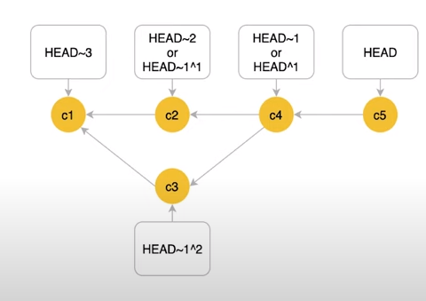

[Learn Git Branching Sandbox](https://learngitbranching.js.org/?locale=ru_RU)

`<filename>` = `.` `<filename>` `<file_path>` `<dir_path/>` `<dir_path/*>` ...

### INSTALLATION

Mac:
```zsh
brew install git 
```

Linux:
```zsh
sudo apt-get -y update && sudo apt-get -y upgrade
sudo apt-get install -y git 
```

### CONFIG

```zsh
git config
```  
	--global  # использовать глобальный файл конфигурации
	--system  # использовать системный файл конфигурации
	--local  # использовать файл конфигурации репозитория. Локальные настройки имеют приоритет над глобальными и системными настройками.
	-f,--file <filename>  # использовать указанный файл конфигурации
	
	--get <key>  # get value
	--get-all <key>  # get all values
	--add <key <value>  # add new a variable
	--unset <key>  # remove a variable
	--unset-all <key>  # remove all matches
	-l,--list  # show all list of variables
	-e,--edit  # open in editor

| Key             | Value                                     |
| :-------------- | :---------------------------------------- |
| user.name       | <user_name>                               |
| user.email      | <user_email>                              |
| core.editor     | vim                                       |
| commit.template | "add"  # can be both a path and some text |
| alias.st        | "status"                                  |
| core.longpaths  | true                                      |
### INIT

```zsh
mkdir <dir_name>
```

Пустые директории в git не добавляются в принципе. Физически директория находится в рабочей директории, но её нет в git, и он её игнорирует.

В <dir_name>:
```zsh
git init
```

### CLONE

```zsh
git clone <HTTPS/SSH> <dir_name>
```

### ИНТЕГРАЦИЯ С GITHUB

```zsh
git branch -M <master/main>
git remote add origin git@github.com:<username_on_github>/<reponame_on_github>.git
git push -u origin <master/main>
```

### РАБОТА С УДАЛЕННЫМ РЕПОЗИТОРИЕМ

Чтобы просмотреть список настроенных удалённых репозиториев
```zsh
git remote
```
	-v  # чтобы просмотреть адреса для чтения и записи, привязанные к репозиторию
    show <remote_name>  # получить побольше информации об одном из удалённых репозиториев
    rename <old_name> <new_name>
    remove <remote_name>

```zsh
git push <remote_name> -d,--delete <branch_name>
git push <remote_name> :<branch_name>
```

### PULL

When the current branch is main:
```zsh
git fetch <remote_name> <branch_name> OR <source>:<target>
```
	# можно использовать относительные ссылки
	# если источник пустой, то target создается
	# <источник>:<получатель> сработает для ветки, на которой вы не находитесь в настоящий момент

Если команда `git fetch` выполняется без аргументов, она скачивает все-все коммиты с удалённого репозитория и помещает их в соответствующие удалённо-локальные ветки в локальном репозитории.
```zsh
git merge <remote_name/branch_name>
```

OR

```zsh
git pull <remote_name> <branch_name>
```


```zsh
git fetch <remote_name> <branch_name> OR <source>:<target>
```
```zsh
git rebase <remote_name/branch_name>
```

OR

```zsh
git pull --rebase <remote_name> <branch_name>
```

### STASH

```zsh
git stash push
```
	-p,--patch -> git add -i
	-S,--staged
	-k,--keep-index;--no-keep-index
	-u,--include-untracked
	-a,--all
	-m,--message <message>

```zsh
git stash branch <branch_name>
```

```zsh
git stash list
```
	+ log-options

```zsh
git stash show <stash_number>
```
	+ diff-options
	-u,--include-untracked;--only-untracked

```zsh
git stash apply <stash_number>
```

```zsh
git stash pop <stash_number>
```

```zsh
git stash drop <stash_number>
```

```zsh
git stash clear
```

### .gitignore

Каждая строчка — это шаблон, по которому происходит игнорирование.

* Игнорируется файл в любой директории проекта:
```text
access.log
```

* Игнорируется директория в любой директории проекта:
```text
node_modules
```

* Игнорируется директория в корне git-репозитория:
```text
/coverage
```

* Игнорируются все файлы с расширением sqlite3 в директории db, но не игнорируются такие же файлы внутри любого вложенного каталога в db, например /db/something/lala.sqlite3:
```text
/db/*.sqlite3
```

* Игнорировать все .txt файлы в каталоге doc/ на всех уровнях вложенности:
```text
doc/**/*.txt
```

- В Unix-подобных системах тильда (`~`) является символом, используемым для обозначения временных файлов или файлов, созданных при редактировании. Например, если вы редактируете файл `example.txt`, он может создать временный файл `example.txt~` для хранения изменений. Запись `~*` в `.gitignore` указывает Git игнорировать все файлы, чьи имена заканчиваются на тильду.
```txt
~*
```

### ИНДЕКС

```zsh
git add <filename>
```
	.  # добавление всех изменений в индекс
	-i <filename>  # показывает измененные куски файлов и спрашивает, что с ними сделать

```zsh
git rm  # rm + git add
```
	--cached <filename>  # if you want to remove files from the Git, but keep the files in your local repository 

### ОТМЕНА ИЗМЕНЕНИЙ В РАБОЧЕЙ ДИРЕКТОРИИ

! Откат незакоммиченных изменений безвозвратен.

```zsh
git clean -n  # "Будет удалено ..."
```
	-f  # удалить неотслеживаемые файлы из рабочей директории
	-fd  # + директории
	-i  # интерактивный режим

```zsh
git restore <filename>  # откат изменений в отслеживаемых файлах/папках
```
	--staged <filename>  # откат изменений, которые попали в индекс, same as "git reset <filename>"

```zsh
git restore --source HEAD~2 <filename>
git reset <hash_commit> -- <filename>
```

Такой командой можно удалить все наши эксперименты на ветке:
```zsh
git checkout HEAD (by default) OR <current_branch_name>
git checkout (--) <filename>  # same as "git restore --staged --worktree <filename>"
```
	-f,--force  # если нужно сделать принудительно
	если файлы между ветками различны, то ошибка; если одинаковы, то изменения беспрепятственно переносятся между ветками
	-- указывает на то, что все следующие аргументы должны быть интерпретированы как пути к файлам или директориям, а не как опции команды

```zsh
git checkout <filename>  # восстановить удаленный файл
git checkout $<hash_commit> <filename>  # восстановить удаленный файл из определенной временной точки
```

Сброс локальной ветки до состояния удалённой
```zsh
git fetch <branch_name>
git reset --hard <remote_name/branch_name>
```
При наличии коммита, который нужно сохранить, перед сбросом нужно создать новую ветку и произвести коммит.

### COMMIT

```zsh
git commit
```
	-m "<comment>"
    <filename> -m "<comment>"  # только для отслеживаемых файлов
    -am "<comment>"  # добавление всего в индекс, а затем - коммит
    --amend  # добавление изменений в текущий коммит, + -m, чтобы изменить навзвание коммита напрямую, без редактора
	--no-edit  # без редактора

[Как склеить коммиты и зачем это нужно](https://htmlacademy.ru/blog/git/how-to-squash-commits-and-why-it-is-needed)

### ОТМЕНА КОММИТОВ

```zsh
git revert <hash_commit>  # добавление ещё одного коммита с противоположными действиями данному, для удаленных репозиториев
```
	-m parent-number  # чтобы избежать конфликта с удалением merge-commit
	-n HEAD  # простая отмена последнего коммита

```zsh
git reset --mixed (by default) HEAD~ OR @~  # отмена последнего коммита, кладет отменненые изменения в work directory, для локальных репозиториев
```
	--soft HEAD~  # отмена последнего коммита, кладет отменненые изменения в индекс
	--hard HEAD~2  # полное удаление последних двух коммитов и файлов/директорий с изменениями
	--hard HEAD@{1} OR <hash_commit>  # восстановление последнего удаленного коммита и файла/директории из истории

Git позволяет удалять коммиты. Это опасная операция, которую нужно делать только в том случае, если речь идет про новые коммиты, которых нет ни у кого, кроме вас. Если коммит был отправлен во внешний репозиторий, то менять историю ни в коем случае нельзя, это сломает работу у тех, кто работает с вами над проектом.

Чтобы переместить коммит в нужную ветку из той, куда был сделан коммит по ошибке, нужно переключиться на новую ветку, которую вы забыли предварительно создать:
```zsh
git checkout -b <new_branch_name>
```
Затем переключиться к оригинальной ветке:
```zsh
git checkout <affected_branch_name>
```
Откатиться до последнего коммита, который нужно сохранить, и сбросить 
```zsh
git reset --hard <hash_last_commit>
```

### PUSH

```zsh
git push <remote_name> <branch_name>
```
	Можно и без аргументов, но тогда это будет непринудительный push, то есть если голова указывает не на удаленную ветку, то ничего не произойдет.
	<remote_name> <source>:<target>  # можно использовать относительные ссылки; если источник пустой, то target удаляется
    -u, --set-upstream <remote_name> <branch_name>  # для связи локальной ветки с веткой удалённого репозитория
    -f, --force <remote_name> <branch_name>  # удаляет из ветки на сервере все коммиты, которых нет в локальной версии, и записывает новые
    --force-with-lease <remote_name> <branch_name>  # заставляет команду завершиться с ошибкой, если в удалённом репозитории есть коммиты, добавленные другими пользователям
    --all <remote_name>  # push all of your local branches

[Откат ошибочной команды `git push --force`](https://gist.github.com/Envek/13d9e406bb2af23f739197e3934ad4f0)

### АНАЛИЗ ИЗМЕНЕНИЙ

```zsh
git diff
```
	--staged  # + изменения, которые попали в индекс
Навигация по пейджеру: `b` – вниз, `f` – вверх, `q` – выход, ...


```zsh
git status
```
	-s  # краткий статус


```zsh
git log
```
	-p  # с дифом для каждого коммита
	--oneline
	--graph
	--all
	--author="<commiter>"
	--diff-filter=D --summary  # покажет список коммитов, в которых удалялись файлы
	--follow  # позволяет вывести все изменения над файлом, даже если в процессе работы он был переименован
	если добавить имя файла в конец команды, отделив его знаками `--`, можно увидеть в каких коммитах он изменялся

Просмотр всех неотправленных коммитов
```zsh
git log --branches --not --remotes
git log origin/master..HEAD
```

Эта команда выведет список количества коммитов, сделанных каждым коммитером. Список будет отсортирован в порядке убывания этого количества.
```zsh
git shortlog -s -n
```


```zsh
git gc  # сборщик мусора
```

Удаление старых веток, стёртых из внешнего репозитория
```zsh
git-remote prune <remote_branch_name>
```


How do I list all the files in a commit?
```zsh
git diff-tree --no-commit-id --name-only -r <hash_commit> 
```
	--no-commit-id  # suppresses the commit ID output
	--name-only  # shows only the file names that were affected
	-r  # argument is to recurse into subtrees

```zsh
git show --pretty="" --name-only <hash_commit>
```
	--pretty  # specifies an empty format string to avoid the cruft at the beginning
	--name-only  # shows only the file names that were affected


Просмотр старого файла
```zsh
git show <hash_commit>:<filename>
```

```zsh
git show <hash_commit>  # можно посмотреть все изменения, сделанные в рамках одного коммита
```
! Хеш довольно длинный, поэтому можно оперировать только первыми 4 или 8 символами.


```zsh
git blame <filename>  # можно узнать, кто последним менял конкретную строку в файле
```


```zsh
git grep <some_string_to_find>
```
	-i <some_string_to_find>  # без учёта регистра
	<some_string_to_find> <hash_commit>  # поиск в конкретном коммите
	<some_string_to_find> $(git rev-list --all)  # поиск по всей истории


```zsh
git reflog
# данные о каждом изменении вершины ветки
git rev-list --all 
# <list_of_all_commits>
git rev-parse HEAD
git rev-parse HEAD^
git rev-parse origin/master 
# <hash_commit>
git rev-parse --abbrev-ref HEAD
# <branch_name>
```

### ВЕТВЛЕНИЕ

```zsh
git checkout <hash_commit>  # detaching HEAD, или переключение между коммитами
git checkout <branch_name>  # переключение между ветками, = git switch <branch_name>
```

```zsh
git switch -  # switch back to previous branch, similar to "cd -"
```

`git checkout` is a very versatile command. It can (among other things) check out or restore specific files or even specific commits, while the new (new since 2019, or more precisely, introduced in Git version 2.23) `git switch` _only_ switches the branch. Additionally, `switch` performs extra sanity checks that `checkout` doesn't, for example switch would abort operation if it would lead to loss of local changes.

Создание и переключение на новую ветку
```zsh
git checkout -b <branch_name>
git switch -c,--create <branch_name>
```

```zsh
git checkout HEAD^<num>  # перемещение в ширину
git checkout HEAD~<num>  # перемещение в глубину
```
	HEAD~1 = HEAD~
	HEAD = @



```zsh
git checkout -b <branch_name> --track <remote_name>/<branch_name>
```

Восстановление удалённой ветки
```zsh
git checkout <hash_last_commit_of_remote_branch_name>
git checkout -b <имя восстановленной удаленной ветки>
```


```zsh
git branch  # способ узнать место нахождения в дереве веток
```
	<branch_name>  # cпособ просто создать ветку
	-r  # show remote branches only
	-d <branch_name>  # удалить ветку
	-D <branch_name>  # удалить ветку принудительно
    -m <branch_name>  # переместить ветку
    -M <branch_name>  # переместить ветку принудительно

```zsh
git branch -m <new_branch_name>  # if you are in an affected branch
git branch -m <deprecated_branch_name> <new_branch_name>  # if you are in other branch
git push origin :<deprecated_branch_name>
git push origin <new_branch_name>
```


```zsh
git merge <название ветки, которую мы хотим влить в текущую ветку>
```
	--abort  # прервать слияние
	--no-ff  # не использовать быструю перемотку


```zsh
git rebase <название ветки, куда производим rebase> <название ветки, которую rebase (можно не указывать, если нужно текущую)>
```
	если ff, то наоборот
	--continue  # если все конфликты разрешены
	--skip  # skip the current commit and continue with the rest of the sequence
	--abort  # чтобы отменить rebase

```zsh
git rebase -i HEAD~<num> OR <hash_commit>  # интерактивный rebase
```


```zsh
git cherry-pick <hash_commit, который мы хотим переместить на текущую ветку>
```
	--continue  # если все конфликты разрешены
	--skip  # skip the current commit and continue with the rest of the sequence
	--abort  # чтобы отменить копирование коммита
	--quit  # forget about the current operation in progress
	-e,--edit  # it will let you edit the commit message prior to committing


### ТЕГИ

```zsh
git tag <tag_name> <hash_commit> OR HEAD  # легковесный тег (указатель)
git tag -a <tag_name> <hash_commit> OR HEAD -m <text>  # аннотированный тег (полноценный объект)
```

```zsh
git tag -l,--list  # the flags are optional; список всех тегов, можно матчить: <tag_name*>
git show <tag_name>
```

```zsh
git checkout <tag_name>
```

```zsh
git push origin <tag_name>
git push origin --tags  # запушить все теги
git push origin --follow-tags  # запушить только аннотированные теги
```

```zsh
git tag -d,--delete <tag_name>
git push origin -d,--delete <tag_name>
git push origin :refs/tags/<tag_name>
```

```zsh
# восстановление удалённого тега
git fsck --unreachable | grep tag  # его поиск
git update-ref refs/tags/<tag_name>  # его восставление
```

```zsh
git describe <branch_name> OR <hash_commit> OR HEAD (by default)
# <tag>_<num_commits>_g<hash_current_commit>
```

```zsh
git tag <new_tag_name> <old_tag_name>
git tag -d,--delete <old_tag_name>
git push origin :refs/tags/<old_tag_name>
git push --tags
```

### EXIT

```zsh
exit
```
OR
```
logout
```

### HELP, VERSION

```zsh
git help <command>
```

```zsh
git --help
```

```zsh
git --version
```

### ...

```zsh
git cat-file -p <hash_commit>
```

### TO-DO

1. [git sparse-checkout](https://martinheinz.dev/blog/109)
2. [git bisect](https://habr.com/ru/articles/591447/)
3. [git submodule](https://radioprog.ru/post/1395)
4. [pre-commit](https://www.youtube.com/watch?v=p2hAddDJ96E&t=1389s)