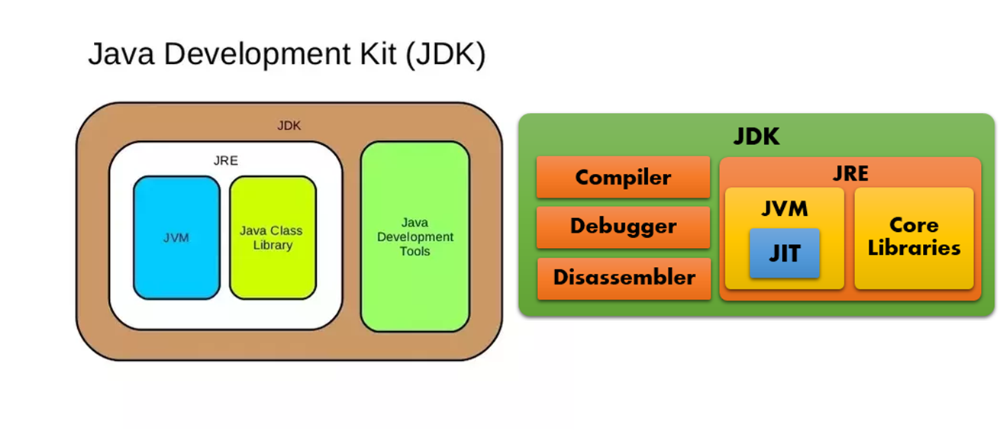

## 1. Verifying Your JDK Installation

To ensure the Java compiler is correctly installed, run:
```zsh
javac -version
```
If you encounter an error, first check whether your `PATH` environment variable is set correctly.

---

## 2. Compiling Source Files

### 2.1. Compiling a Single File

To compile your Java source code into bytecode:
```bash
javac Draft.java
```

### 2.2. Compiling with External Libraries

If your code requires external libraries, include them using the `-classpath` option:
```bash
javac -classpath lib.jar Draft.java
```
To compile multiple files, list them separated by a space.

---

## 3. Inspecting Bytecode

Use the `javap` utility to inspect the compiled class:
```zsh
javap Draft.class
```

For detailed information, add the `-v` (verbose) option:
```zsh
javap -v Draft.class
```

---

## 4. Running the Program

### 4.1. Basic Execution

If the bytecode is in the current directory, run the program with:
```zsh
java Draft
```

### 4.2. Specifying the Classpath

If your files reside in a different directory, specify the path using the `-classpath` option:
```zsh
java -classpath <path/to/bytecode> Draft
```

### 4.3. Using External Libraries

When external libraries are required, include them in the `-classpath`. Note the classpath delimiter: `:` for Linux/Mac, `;` for Windows:
```zsh
java -classpath lib.jar:draft.jar Draft  # for Linux/Mac
```

> **Important:** If your program consists of multiple classes, ensure all of them are available to the JVM.

---

## 5. Working with JAR Files

A `jar` file is a portable ZIP archive that includes a `MANIFEST` file containing metadata (such as the program’s name, version, and main class).

### 5.1. Creating a JAR File

To create a JAR file that includes your main class and necessary files:
```zsh
jar cfe draft.jar Draft Draft.class ...
```

### 5.2. Viewing JAR Contents

To see what’s inside a JAR file:
```zsh
jar tf draft.jar
```

### 5.3. Extracting JAR Contents

To extract the contents of a JAR file:
```zsh
jar xf draft.jar
```

### 5.4. Running a Program from a JAR File

If a main class is specified in the JAR:
```zsh
java -jar draft.jar
```

Otherwise, specify the main class via:
```zsh
java -classpath draft.jar Draft
```

---
